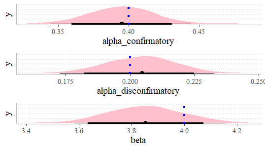

## Model with confirmatory and disconfirmatory alphas
This is a model which has two separate alpha parameters depending on whether the prediction error was positive or negative. It uses these alphas to update both chosen and unchosen cards. 

Read ["The computational roots of positivity and
confirmation biases in reinforcement learning"](https://www.sciencedirect.com/science/article/pii/S1364661322000894) 
 for more information.

### Parameter recovery

